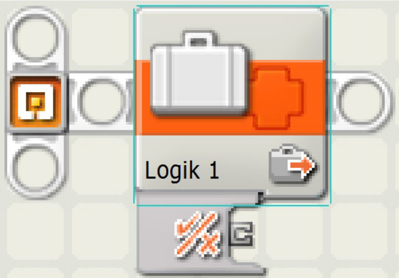
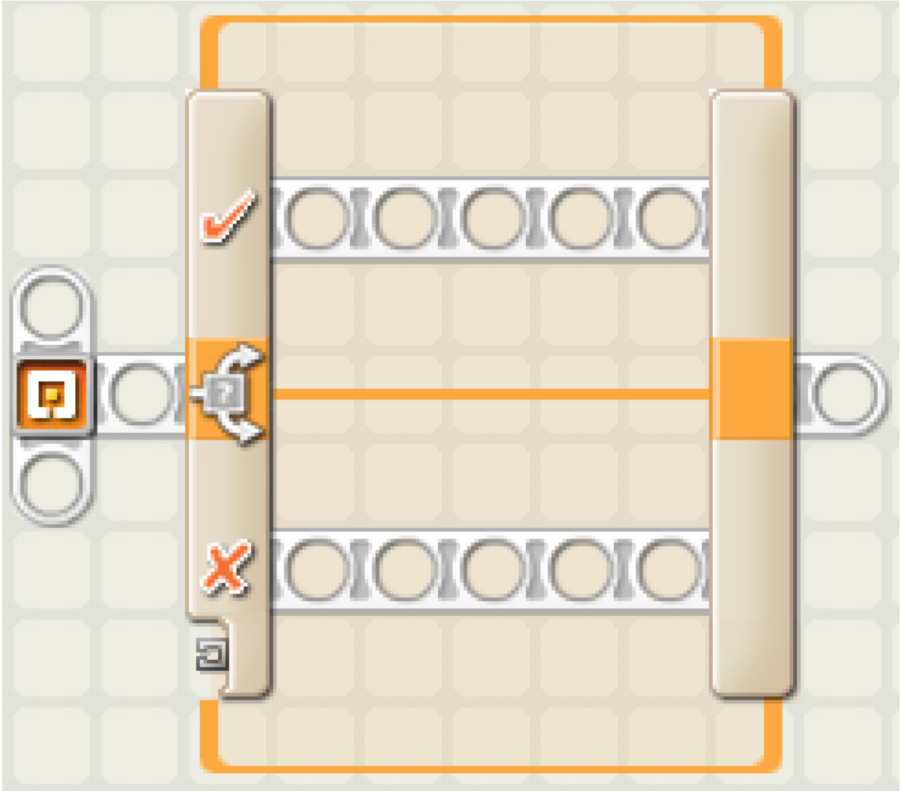
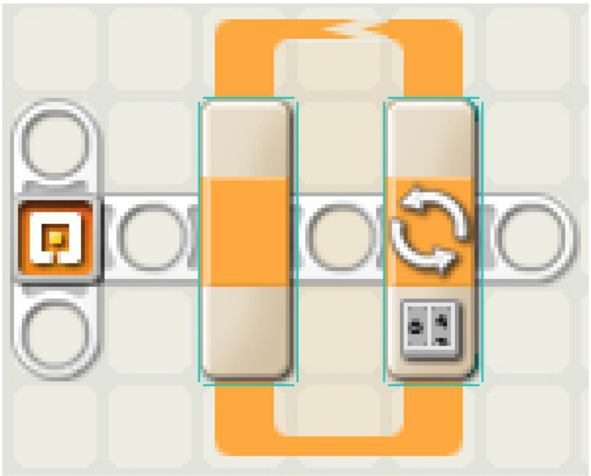
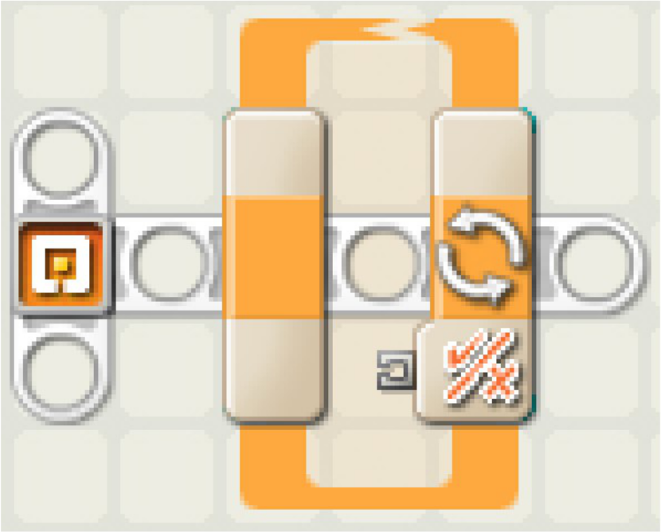

# Programmierung mit Java und leJOS

---

# <center>Was ist Java?</center>


---

# <center>Grundstruktur</center>

```java
public class HelloWorld {
	
  public static void main(String[] args){
    	
  }
}
```

---

# <center> Variablen</center>



---

# Variablen


|Typ|Wert|Beispiel|
|:-:|:-:|:-:|
|`boolean`| Wahrheitswert| `true / false` |
|`int` | Ganzzahl | `1, 42, -7` |
|`double` | Kommazahl | `0.4343, 3.1415`|
|` String` | Zeichenkette | `"Hallo Welt"`|

---

# <center>Variablen</center>

```java
public class Variablen{
	
  public static void main(String[] args){
    	
    boolean a = true;
    boolean b = 5 > 4;                // true
    boolean c = ("apfel" == "birne"); // false
        
    int d = 42;
    int e = 10 + 12; // 22
    int f = 2 * 7; 	 // 14
        
    double f = 3.1415;
    double g = 25.5 / 3; // 8.5
        
    String d = "Hallo Welt";
        
  }
}
```
---

```java
public class Objekte {

  public static void main(String[] args){
    
    TouchSensor ts = new TouchSensor(SensorPort.S1);
    
  }
}
```

---

# <center>If-Anweisung</center>



---
```java
public class Abfrage {

    public static void main(String[] args){
    
        if(<Bedingung>){
            // wenn Bedingung == true 
        }
        else{
            // wenn Bedingung == false
        }
    }
}
```

---

```java
public class Abfrage {

    public static void main(String[] args){
    	
        if(5 > 4){
            // wenn Bedingung == true 
        }
        else{
            // wenn Bedingung == false
        }
    }
}
```

---

# <center>Schleifen</center>
---



---

```java
public class ForSchleife {
    
  public static void main(String[] args){
        
    for(int i=0; i < 10;i++){
    
    }
        
  }
}
```
  
--- 
 

 
---
  
```java
public class WhileSchleife {

  public static void main(String[] args){
        
    while(5 < 10){
           
    }
        
  }
}
```

---


---

# <center>Hello World!</center>
---

1. File  $\rightarrow$ New $\rightarrow$ Project...
2. LeJOS $\rightarrow$ LeJOS NXT Project $\rightarrow$ Next
3. Projektnamen eingeben
4. Finish
5. Rechtsklick auf src-Ordner
6. New $\rightarrow$ Class
7. Namen eingeben
8. Finish

---

```java
public class HelloWorld {

  public static void main(String[] args){

    System.out.println("Hello World!");
   
  }
}
```
---
1. Roboter verbinden und einschalten
2. Run
3. `LeJOS NXT Project` ausw&auml;hlen

---

```java
import lejos.nxt.Button;

public class HelloWorld {

  public static void main(String[] args){

    System.out.println("Hello World!");
        
    Button.waitForAnyPress();
    
  }
}
```

---

# <center>Motoren ansteuern </center>


---

```java
import lejos.nxt.Motor;

public class Motoren {

  public static void main(String[] args) {

    Motor.A.rotate(360);
    Motor.B.rotate(360);
    
  }
}
```

---
```java 
import lejos.nxt.Motor;

public class Motoren {

  public static void main(String[] args) {
    
    Motor.A.forward();
    Motor.B.forward();
    
  }
}
```

---

```java
import lejos.nxt.Motor;
import lejos.util.Delay;

public class Motoren {

  public static void main(String[] args) {

    Motor.A.forward();
    Motor.B.forward(); 
		
    Delay.msDelay(1000);
    
  }
}
```


---

# <center> Drucksensor </center>
--- 
```java
import lejos.nxt.Button;
import lejos.nxt.SensorPort;
import lejos.nxt.TouchSensor;

public class Drucksensor {
	
  public static void main(String[] args) {
		
    TouchSensor ts = new TouchSensor(SensorPort.S1);
		
    if(ts.isPressed()){
      System.out.println("Gedrueckt");
    }
    else {
      System.out.println("Nicht gedrueckt");
    }
      
    Button.waitForAnyPress();
    
  }
}
```
---

```java
import lejos.nxt.Button;
import lejos.nxt.SensorPort;
import lejos.nxt.TouchSensor;
import lejos.util.Delay;

public class Drucksensor2 {

  public static void main(String[] args) {
  
    TouchSensor td = new TouchSensor(SensorPort.S1);
    System.out.println("Warte ...");
		
    while(ts.isPressed() == false){
        Delay.msDelay(100);
    }
	
    System.out.println("Gedrueckt");
    
    Button.waitForAnyPress();
    
  }
}
```
---

# Aufgabe
Schreibe ein Programm, das den Roboter geraudeaus fahren l&auml;sst, bis dieser gegen etwas st&ouml;sst.

---
```java
import lejos.nxt.Motor;
import lejos.nxt.SensorPort;
import lejos.nxt.TouchSensor;
import lejos.util.Delay;

public class Drucksensor3 {

  public static void main(String[] args) {
    TouchSensor ts = new TouchSensor(SensorPort.S1);
		
    while(ts.isPressed() == false){
      Motor.A.forward();
      Motor.B.forward(); 
      Delay.msDelay(100);
    }
    
  }
}
```
---

# <center> Differential Pilot </center>

---

```java
import lejos.nxt.Motor;
import lejos.robotics.navigation.DifferentialPilot;

public class Pilot {

  public static void main(String[] args) {
    DifferentialPilot pilot = new DifferentialPilot(56,
    				135, Motor.B, Motor.A);
		
    
    
    
  }
}
```

---

```java
import lejos.nxt.Motor;
import lejos.robotics.navigation.DifferentialPilot;

public class Pilot {

  public static void main(String[] args) {
    DifferentialPilot pilot = new DifferentialPilot(56,
    				135, Motor.B, Motor.A);
		
    pilot.travel(100);
    pilot.rotate(90);
    
  }
}
```

---

# Aufgabe
Lasse den Roboter ein Quadrat fahren

---

```java
import lejos.nxt.Motor;
import lejos.robotics.navigation.DifferentialPilot;

public class PilotViereck {

  public static void main(String[] args) {
    DifferentialPilot pilot = new DifferentialPilot(56,
    				135, Motor.B, Motor.A);
		
    pilot.travel(100);
    pilot.rotate(90);
		
    pilot.travel(100);
    pilot.rotate(90);
    
    pilot.travel(100);
    pilot.rotate(90);
    
    pilot.travel(100);
    pilot.rotate(90);
    
  }
}
```

---

```java
import lejos.nxt.Motor;
import lejos.robotics.navigation.DifferentialPilot;

public class PilotViereck {

  public static void main(String[] args) {
    DifferentialPilot pilot = new DifferentialPilot(56,
    				135, Motor.B, Motor.A);
		
    for (int i = 0; i < 4; i++) {
      pilot.travel(100);
      pilot.rotate(90);
    }
		
  }
}
```

---

# Aufgabe

Ver&auml;ndere das Programm so, dass der Roboter ein regelm&auml;ssiges Vieleck fahren kann.
Die Anzahl der Ecken soll dabei in einer Variablen gespeichert werden.

---

```java
import lejos.nxt.Motor;
import lejos.robotics.navigation.DifferentialPilot;

public class Vieleck {

  public static void main(String[] args) {
    DifferentialPilot pilot = new DifferentialPilot(56,
    				135, Motor.B, Motor.A);
    int anzahl = 5;
    
    for (...) {
      pilot.travel(100);
      ...
    }
		
  }
}
```

---

```java
import lejos.nxt.Motor;
import lejos.robotics.navigation.DifferentialPilot;

public class Vieleck {

  public static void main(String[] args) {
    DifferentialPilot pilot = new DifferentialPilot(56,
    				135, Motor.B, Motor.A);
    int anzahl = 5;
    
    for (int i = 0; i < anzahl; i++) {
      pilot.travel(100);
      pilot.rotate(360 / anzahl);
    }
		
  }
}
```

---

# <center>Ultraschallsensor</center>

---

```java
import lejos.nxt.Button;
import lejos.nxt.SensorPort;
import lejos.nxt.UltrasonicSensor;

public class Ultraschall {

  public static void main(String[] args) {
    UltrasonicSensor us = new UltrasonicSensor(
    					SensorPort.S2);
		
    while(Button.ESCAPE.isUp()){
      System.out.println(us.getDistance());
    }
		
  }
}
```

---

# <center> Lichtsensor </center>
 
---

```java
import lejos.nxt.Button;
import lejos.nxt.SensorPort;
import lejos.nxt.LightSensor;

public class LichtSensor {

  public static void main(String[] args){
    LightSensor ls = new LightSensor(SensorPort.S3);
    
    while(Button.ESCAPE.isUp()){
    	System.out.println(ls.readValue());
    }
  
  }
}
```
